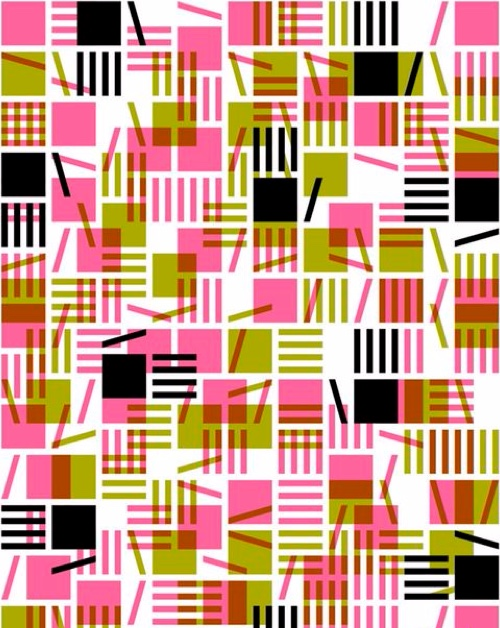

# Day 02

## Grids & Iterative Patterns
I was inspired by the book [Generative Gestaltung](http://www.generative-gestaltung.de/2/) and it's online examples. Most of which I saw used a grid interacting with my mouse coordinates to e.g increase the density or size of the elements on the grid.

So I borrowed that idea and started with something that looks like a bubble foam:


## Bubble Foam



<iframe src="content/day02/02/embed.html" width="100%" height="800" frameborder="no"></iframe>


The code for this is really straight forward: draw white circles with random size, scaling with the mouse cursor's location.

```js
function draw() {
  background(100, 100, 100, 250)
  strokeWeight(5)
  radius = 150/mouseX*width
  console.log(mouseX)
  for (let i = 0; i < gridYAmount; i++) {
    for (let j = 0; j < gridXAmount; j++) {
      circle(tileHeight*(j+0.5), tileWidth*(i+0.5), random(radius))
    }
  }
}
```


## Random Shapes

The next image that struck my attention was this one:



It seemed simple to recreate. Just a bunch of shapes with random colors distributed on a grid.

### 1. Lines
I already had the grid so I started with lines:


<iframe src="content/day02/03-1/embed.html" width="100%" height="800" frameborder="no"></iframe>



```js
function form1(x, y) {
  let amount = random(1,5)
  for (let i = 0; i < amount; i++) {
    line(x+tileWidth/(amount+1)*i, y, x+tileWidth/(amount+1)*(i+1), y+tileHeight)
  }
}
```

### 2. Circles
Next up were randomly sized circles:


<iframe src="content/day02/03-2/embed.html" width="100%" height="800" frameborder="no"></iframe>



```js
function form2(x, y) {
  let size = random(0.8, 2)
  if (size < 1) {
    stroke(color2)
    fill(color2)
  } else if (size > 1.5) {
    stroke(color3)
    fill(color3)
  } else {
    stroke(color1)
    fill(color1)
  }
  ellipse(x + tileWidth / 2, y + tileHeight / 2, tileWidth / size, tileHeight / size)
}
```

### 3. Combination of lines and Circles
With two different shapes I began to use both at the same time.
Even though I only had two shapes, there were already 4 different ways for me to fill a tile in the grid:

1. Lines
2. Circles
3. Lines + Circles
4. Nothing


<iframe src="content/day02/03-3/embed.html" width="100%" height="800" frameborder="no"></iframe>



```js
function draw() {
  background(0, 0, 95, 100)
  strokeWeight(5)
  for (let i = 0; i < gridXAmount; i++) {
    for (let j = 0; j < gridYAmount; j++) {
      formRoulette(tileWidth * (i), tileHeight * (j))
    }
  }
}

function formRoulette(x, y) {
  let chance1 = 0.5
  let chance2 = 3
  let chance3 = 8
  let totalchance = 10
  let take = random(0, totalchance)
  if (take <= chance1) {
    let offsetX = random(tileWidth/3)
    let offsetY = random(tileHeight/3)
    form1(x+offsetX, y+offsetY);
    offsetX = random(tileWidth/3)
    offsetY = random(tileHeight/3)
    form2(x+offsetX, y+offsetY);
  } else if (take > chance1 && take <= chance2) {

  } else if (take > chance2 && take <= chance3) {
    form1(x, y)
  } else if (take > chance3 && take <= totalchance) {
    form2(x, y)
  }
}
```

### 4. Squares
Lastly I tried to add in some squares like they don't belong to the grid by rotating them and having them much larger than the usual tile size: 


<iframe src="content/day02/03-4/embed.html" width="100%" height="800" frameborder="no"></iframe>



```js
function form3(x, y) {
  let size = random(0.3, 1.2)
  if (size < 0.6) {
    stroke(color4)
    fill(color4)
  } else if (size > 1) {
    stroke(color1)
    fill(color1)
  } else {
    stroke(color3)
    fill(color3)
  }
  push()
  rotate(random(360))
  rect(x + tileWidth / 2, y + tileHeight / 2, tileWidth / size, tileHeight / size)
  pop()
}
```

Personally I didn't like it as much compared to just lines and circles. 

The generated pictures became a bit to busy...