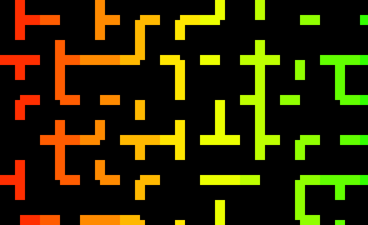
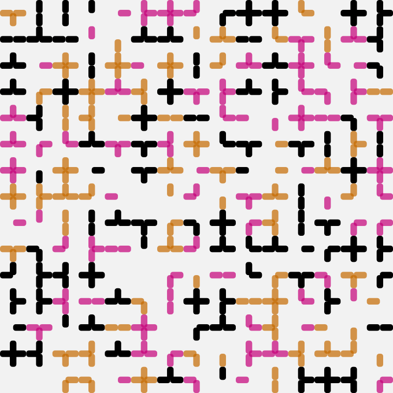

# Day 03 - Clock

## Animating a Maze into a Clockwork

Today's topic was about visualising the passing of time - an abstract form of a clock if you will. My mind immediatly ran to an idea I had to scrap yesterday because a lack of time. 

In the same course a friend created this maze yesterday which he wanted to animate (rotate each part on the grid): <br>
Unfortunately to our knowledge, there is no easy way to rotate the squares around an axis for each grid tile. 



push(), rotate(), translate and pop() are cumbersome to work with and we wouldn't know of any method to access drawn rectangles in p5.js

So I had to the housework myself and keep track of my rectangles myself.

```js
let mazeTiles = []
class mazeTile {
  constructor(x, y, timer, color, labString) {
    this.x = x;
    this.y = y;
    this.timer = timer;
    this.color = color;
    this.labString = labString;
  }
}
```

The "labString" is a 4 character long string of zeroes and ones to indicate which squares of the cross for my labyrinth I have to draw.


```js
let randomString = ""
for (let s = 0; s < 4; s++) {
    let rng = random(2)
    randomString += rng > 0.81 ? "1" : "0"
}
```

### Static Maze

Add in some color and that is the result:



<br>
Next I wanted to add the rotation.<br>
After giving it some thought I came up with the idea to not rotate the squares but to just transform and translate. <br>
With the help of p5's rectMode(CORNERS); I would change the corner-coordinates of the upper rectangle to the one on the right.

To make it snappy, I wanted to use one of the [easing methods](https://spicyyoghurt.com/tools/easing-functions) we got presented today:



<iframe src="content/day03/01/lerp example.html" width="400" height="400" frameborder="no"></iframe>


After some playing around I chose "easeInOutQuint".<br>
It took me quite a lot of effort to wrap my mind around multiple staggered timers but managed to put everything together in the end.

### Quintic Easing


<iframe src="content/day03/01/embed.html" width="100%" height="800" frameborder="no"></iframe>


### Elastic Easing



<iframe src="content/day03/01-2/embed.html" width="100%" height="800" frameborder="no"></iframe>


You can find the full code [here](https://github.com/simitomorrow/GENCG/blob/master/content/day03/01/sketch.js).