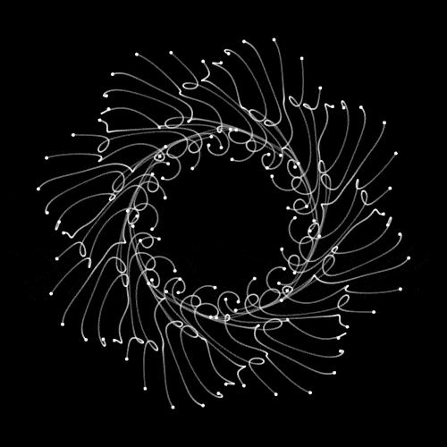
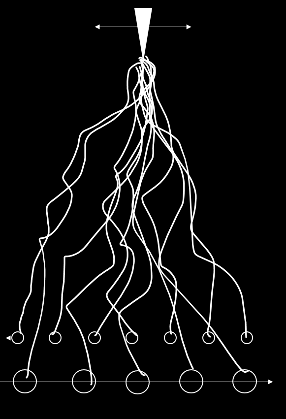

# Day 04 - Machines

## Delayed Lerp

### Inspiration

One of the resources we got for inspiration contained this:



There were many more [examples](https://necessarydisorder.wordpress.com/2018/03/31/a-trick-to-get-looping-curves-with-lerp-and-delay/) of amazing looking mathematical patterns and I tried to create some myself.

In short the trick is to describe a movement of two points in terms of a parameter t and then lerping between the two with a modified t:

```js
let timer = 1 * (frameCount - 1) / 100;
let detail = 1000;
let delay = 1.5;
for (let i = 0; i <= detail; i++) {
    let deltaT = 1 * i / detail;
    let x = lerp(x1(timer - delay * deltaT), x2(timer - delay * (1 - deltaT)), deltaT);
    let y = lerp(y1(timer - delay * deltaT), y2(timer - delay * (1 - deltaT)), deltaT);
    point(x, y);
}
```

### Recreation, Positive Delay (1.5)



<iframe src="content/day04/01/embed.html" width="100%" height="800" frameborder="no"></iframe>


### Recreation, Negative Delay (-1.5)



<iframe src="content/day04/01-1.5/embed.html" width="100%" height="800" frameborder="no"></iframe>


### Recreation, no Delay (0)



<iframe src="content/day04/01-0/embed.html" width="100%" height="800" frameborder="no"></iframe>


This took me quite a while to understand.
After this I wanted to recreate a sketch with this concept:<br>
Two rows of rings moving in a line and wrapping around the canvas connected to a moving needle on the top.



But I couldn't recreate it. The previous examples use sin() and cos() which allow t to grow without having to worry about it getting to big, since the two functions loop in themselves.

Creating a function to wrap around the canvas expressed in a formula with t was too much of an ask for my brain that day.


<iframe src="content/day04/01-2/embed.html" width="100%" height="800" frameborder="no"></iframe>


My circles would disappear at some point because of t getting so big, one tick would wrap the entire canvas. <br> As an afterthought I could have animated the circles without the need of a parameter t and create one for the lines seperatly...