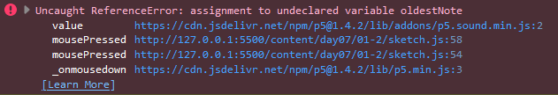

# Day 07 - Pixel
Our last task was to work with pixels. <br>
I wanted to continue working with sound and came up with the idea:
> What would an image sound like, if each pixel had its own pitch?

I wanted to create a grid, this time with clickable squares (pixel) to activate them: Active/black colored pixels would create a pitch, white ones would be inactive.

After giving it some more thought, I came to the conclusion, that this should quickly sound horrible, if you were to actually draw something, haha. 

### Soundboard

Either way I rolled with the idea and started simple:<br>
Use p5's sound library polysinth to create a specificly pitched sound attached to a pixel.


<iframe src="content/day07/01/embed.html" width="800" height="800" frameborder="no"></iframe>


Clicking the grid will toggle a note on and off.

### Clickable Pixel

Next was to make the pixels clickable in addition to toggle their corresponding note.

This wasn't as easy as I thought: <br>
Initially I would iterate through each pixel on every draw() frame and check if it was active. If yes I would play a note with a duration of one second. <br> But playing a note on every frame reactivated the sound and made it sound choppy.

In the end I had to keep track what notes were active myself and had to stop them with the method:
```js
polySynth.noteRelease(pixel.pitch)
```


<iframe src="content/day07/01-2/embed.html" width="800" height="800" frameborder="no"></iframe>


For some reason though, the library could only handle 8 notes simultaneously. <br> If you click on more pixels an exception occurs:



This and the fact that disabling a pixel would sometimes disable multiple notes disheartened me from continuing adding more features.

A couple of ideas I had:
- Multiple colors which would correspond to a rhythm
- An image importer to "play" its pixels
- A midi importer to visualise the notes on the grid